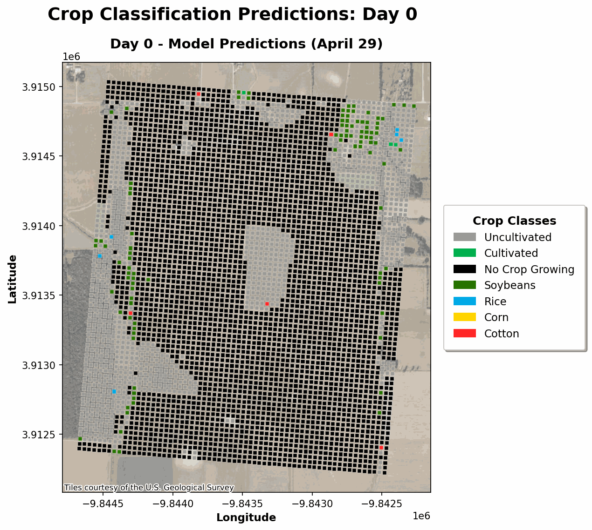
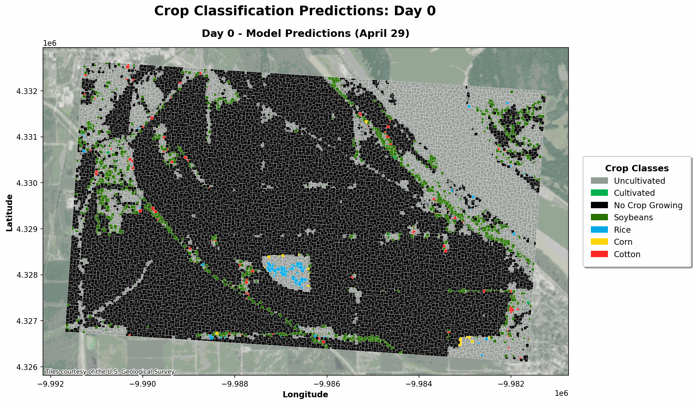
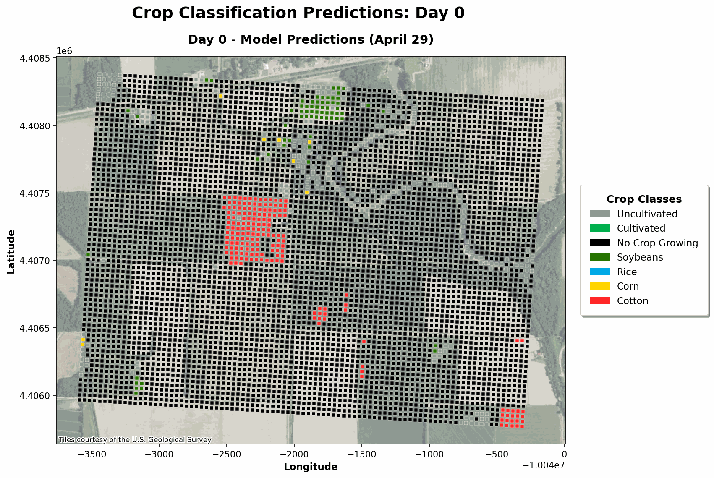

# Crop Rotation Cycle Predictor

A deep learning tool for predicting crop rotation cycles using Sentinel-2 satellite imagery and USDA Cropland Data Layer (CDL) labels. This system analyzes temporal patterns in multispectral satellite data to classify crop types and predict rotation sequences across agricultural regions in the United States.

## Visual Predictions

The following animations show predicted crop rotation cycles for 2024 across four different agricultural zones:

<div align="center">

| Zone 1 | Zone 2 |
|:------:|:------:|
|  |  |
| **Zone 3** | **Zone 5** |
|  |  |

</div>

---

## Overview

This tool combines:
- **Sentinel-2 satellite imagery**: Multispectral temporal data capturing crop growth patterns
- **USDA CDL labels**: Ground truth crop classifications for training
- **Deep learning models**: Time series classifiers that learn temporal signatures of different crops
- **Rotation cycle prediction**: Spatial-temporal analysis to predict crop sequences across agricultural zones

---

# Initial Setup

This project provides two options for setting up your development environment:
1. **Local Virtual Environment** (recommended for direct development)
2. **Docker Environment** (recommended for reproducibility and isolation)

Choose the option that best fits your workflow. For detailed instructions, troubleshooting, and GPU configuration, see [Environment Setup Guide](doc/environment_setup.md).

---

## Option 1: Local Virtual Environment

**Prerequisites:** Python 3.10, NVIDIA drivers, CUDA 12.2

```bash
# 1. Create and activate environment
virtualenv venv --python=python3.10
source venv/bin/activate

# 2. Install dependencies
pip install --upgrade pip setuptools wheel
pip install -r requirements.txt

# 3. Verify GPU
python config/gpu/check_gpu.py

# 4. Ready! Run your first command
bash cropclassifier.sh -action test -model simplecnn
```

---

## Option 2: Docker Environment

**Prerequisites:** Docker, Docker Compose, nvidia-container-toolkit

```bash
# 1. Verify GPU support
./docker-run.sh check

# 2. Build image (only first time, ~15 min)
./docker-run.sh build

# 3. Start container
./docker-run.sh start

# 4. Verify GPU
./docker-run.sh exec 'python config/gpu/check_gpu.py'

# 5. Ready! Run your first command
./docker-run.sh exec 'bash cropclassifier.sh -action test -model simplecnn'
```

### Running Bash Scripts

```bash
# Option A: Open interactive shell
./docker-run.sh shell
# Then run commands inside:
bash build_training_data.sh multiple all
bash cropclassifier.sh -action train -model inception1d

# Option B: Execute commands directly
./docker-run.sh exec 'bash build_training_data.sh multiple all'
./docker-run.sh exec 'bash cropclassifier.sh -action train -model inception1d'
```

### Starting JupyterLab

```bash
./docker-run.sh jupyter
# Access at http://localhost:8888
```

### Docker Helper Commands

```bash
./docker-run.sh check      # Verify GPU support
./docker-run.sh build      # Build Docker image
./docker-run.sh start      # Start main container
./docker-run.sh shell      # Open shell in container
./docker-run.sh exec 'cmd' # Execute command
./docker-run.sh jupyter    # Start JupyterLab
./docker-run.sh logs       # Show container logs
./docker-run.sh stop       # Stop all containers
```

### Stopping and Cleaning Up

```bash
# Stop all running containers
docker compose stop

# Stop and remove containers
docker compose down

# Remove everything (containers, images, volumes)
docker compose down --volumes --rmi all
```

---

## Downloading Training Data

The `data/` directory structure is included in this repository, but the actual data files are not tracked by Git due to their large size. You need to download the preprocessed training data separately.

### Data Structure

The project expects the following directory structure:
```
data/
├── test/          # Test dataset (CDL and Sentinel-2 time series)
└── valtrain/      # Training and validation datasets (CDL and Sentinel-2 time series)
```

### Download Preprocessed Data

Preprocessed training data (CDL samples and Sentinel-2 time series) is available for download:

**📥 [Download Data from Google Drive](https://drive.google.com/drive/folders/19oRelb1hS0zHS49-m0DCU4KITtuak26y?usp=drive_link)**

After downloading, extract the data into the corresponding directories:
- Place test data in `data/test/`
- Place training/validation data in `data/valtrain/`

### Alternative: Build Your Own Training Data

If you prefer to build the training data from scratch, follow the instructions in the [Crop Classifier Configuration](#crop-classifier-configuration) section below. This involves:
1. Downloading CDL raster files from the USDA CDL data portal
2. Querying Sentinel-2 STAC API for satellite imagery
3. Processing and transforming the data into time series format

---

# Crop Classifier Configuration

Before training models, you need to configure which CDL (Cropland Data Layer) areas and years will be used for training/validation and testing. This configuration is done by selecting bounding boxes (bboxes) from CDL data files.

## Overview

The classifier uses a configuration file (`config/bbox_config.txt`) that specifies:
- **Scene identifiers**: Names for each area of interest
- **Bounding boxes**: Geographic coordinates defining the area boundaries
- **Years**: Which years of data to process for each area

These configurations are split into:
- **Training/Validation sets**: Used to train and validate models
- **Test sets**: Used for final model evaluation

## Using the Configuration Notebook

The notebook `notebooks/0.get_bbox_from_CDL.ipynb` provides a graphical interface to extract bounding boxes from CDL `.zip` files downloaded from the USDA CDL data portal.

### Workflow

1. **Download CDL files**: Download `.zip` files from the USDA CDL data portal for your areas of interest
2. **Process with notebook**: Use the notebook to extract bounding box coordinates
3. **Copy configuration**: Copy the generated configuration lines into `config/bbox_config.txt`

### Configuration Modes

#### Single Scene Mode

For processing one area with one year:

```python
# Process a single CDL zip file
aoi_path = "../data/test/CDL_1675300360.zip"
# ... processing code ...
# Output: example_unique_scene|484932,1401912,489035,1405125|2024
```

**Format**: `scene_name|bbox_coordinates|year`

#### Multiple Scenes Mode

For processing multiple areas with multiple years:

```python
# Process multiple CDL zip files
zip_files = glob.glob("../data/valtrain/*.zip")
years = [2020, 2021, 2022, 2023]
# ... processing code ...
# Output: Multiple configuration lines
```

**Format**: `scene_name|bbox_coordinates|year1,year2,year3,...`

### Configuration File Format

The `config/bbox_config.txt` file uses a simple pipe-delimited format:

```
example_multiple_scene01|426362,1405686,520508,1432630|2019,2020,2021
example_multiple_scene02|390747,1195097,437820,1284288|2019,2020,2021
example_unique_scene|484932,1401912,489035,1405125|2024
```

Each line represents:
- **Scene identifier**: A unique name for the area
- **Bounding box**: `minx,miny,maxx,maxy` coordinates in EPSG:5070 projection
- **Years**: Comma-separated list of years to process

### Execution Workflow

Once your `bbox_config.txt` is configured, follow these steps in order:

#### Step 1: Download Training Data

Use `build_training_data.sh` to download CDL and Sentinel-2 data. The execution mode depends on your configuration:

**Unique Mode** (single bbox/year):
```bash
# Run all steps: CDL download → Sentinel-2 download → Transform to time series
bash build_training_data.sh unique all

# Or run steps individually:
bash build_training_data.sh unique cdl        # Step 1: Download CDL data
bash build_training_data.sh unique sentinel  # Step 2: Download Sentinel-2 scenes
bash build_training_data.sh unique transform # Step 3: Transform to time series
```

**Multiple Mode** (multiple bboxes/years):
```bash
# Run all steps for all configured scenes
bash build_training_data.sh multiple all

# Or run steps individually:
bash build_training_data.sh multiple cdl
bash build_training_data.sh multiple sentinel
bash build_training_data.sh multiple transform
```

**Output**: This generates Parquet files containing time series data:
- Unique mode: `data/test/CDL_unique_scene_ts.parquet/`
- Multiple mode: `data/valtrain/CDL_multiple_scene_ts.parquet/`

#### Step 2: Configure Training Parameters

After downloading data, configure `config/dataloader.txt` with all parameters needed for training. This file contains four main sections:

##### 2.1 Data Paths (`[paths]`)

Configure paths to your downloaded Parquet files. The `[paths]` section specifies where to find training, validation, and test datasets.

**Understanding the data structure**:

- **Unique mode** (`build_training_data.sh unique`): Downloads **one bbox for one year**. Typically used for **test data**.
  - Output: `data/test/CDL_unique_scene_ts.parquet/`

- **Multiple mode** (`build_training_data.sh multiple`): Downloads **multiple bboxes for one or more years**. Used for **training and validation data**.
  - Output: `data/valtrain/CDL_multiple_scene_ts.parquet/`
  - When you configure multiple years per bbox (e.g., `2020,2022`), all data goes into the same Parquet file
  - You then **separate by year** in `dataloader.txt` to create train/val splits

**Configuration example**:

If you downloaded:
- **Test data** using `unique mode` (e.g., year 2019)
- **Train/Val data** using `multiple mode` with multiple bboxes and years (e.g., 2020, 2021)

Configure `dataloader.txt` like this:
```ini
[paths]
train_path=data/valtrain/s2_multiple_scene.parquet/*/*2021*/*.parquet
val_path=data/valtrain/s2_multiple_scene.parquet/*/*2020*/*.parquet
test_path=data/test/s2_unique_scene.parquet/*/*2019*/*.parquet
```

**Key points**:
- Both `train_path` and `val_path` point to the **same Parquet file** (`CDL_multiple_scene_ts.parquet`)
- They are separated by **year** using glob patterns (`*2021*` vs `*2020*`)
- `test_path` points to the **separate test dataset** from unique mode
- Paths use glob patterns: `*` matches any directory level, `*2021*` filters by year, `*.parquet` matches Parquet files

##### 2.2 Hyperparameters (`[hyperparams]`)

Configure model architecture and training parameters:

```ini
[hyperparams]
model_name=simplecnn                    # Model architecture (simplecnn, inception1d, resnet1d, etc.)
batch_size=1028                         # Batch size for training/testing
days_in_series=120                       # Time window length (days)
days_per_bucket=5                        # Temporal bucketing interval (days)
frames_to_check=2                        # Number of frames to sample per series
num_features=16                          # Number of input features (bands + indices)
max_epochs=60                            # Maximum training epochs
es_patience=15                           # Early stopping patience (epochs)
bucketing_strategy=random                # Sampling strategy: random, early_season, late_season, deterministic
test_year=2019                          # Year used for test set evaluation
```

**Key parameters**:
- **`model_name`**: Choose from available architectures (see Step 3 for full list)
- **`days_in_series`**: Length of temporal window to analyze (typically 120 days)
- **`days_per_bucket`**: Groups observations into time buckets (e.g., 5 days per bucket)
- **`frames_to_check`**: Number of temporal samples per series (affects dataset size and class balance)
- **`bucketing_strategy`**: How to sample temporal data (`random` recommended for balanced datasets)
- **`es_patience`**: Early stopping patience to prevent overfitting

##### 2.3 Crop Classification (`[targeted_crops]`, `[other_crops]`, `[label_legend]`)

Define which crops to classify and how to group them:

```ini
[targeted_crops]
Soybeans
Rice
Corn
Cotton

[other_crops]
Other Hay/Non Alfalfa
Pop or Orn Corn
Peanuts
Sorghum
# ... (list of other cultivated crops)

[label_legend]
Uncultivated
Cultivated
No Crop Growing
Soybeans
Rice
Corn
Cotton
```

**Understanding crop categories**:

- **`[targeted_crops]`**: Crops that receive **individual labels** (e.g., Soybeans=3, Rice=4, Corn=5, Cotton=6)
  - These are the main crops you want to distinguish and classify separately
  - Each crop gets its own class in the final model output

- **`[other_crops]`**: Other cultivated crops that are **grouped together** as "Cultivated" (label=1)
  - These crops are recognized as cultivated but not individually classified
  - Useful for crops that are less common or less important for your specific use case

- **`[label_legend]`**: Defines the **final label mapping** for model output
  - Order matters: `[Uncultivated, Cultivated, No Crop Growing, Soybeans, Rice, Corn, Cotton]`
  - Labels 0-2 are special classes (Uncultivated, Cultivated, No Crop Growing)
  - Labels 3+ correspond to targeted crops in order

**Label encoding logic**:
- Label 0: Uncultivated land
- Label 1: Other cultivated crops (from `[other_crops]`)
- Label 2: Ambiguous (cultivated but no vegetation detected in final frames)
- Label 3+: Targeted crops (position in `[targeted_crops]` + 3)

**🔧 Discovering CDL Classes for Your Region**:

When working with data from different regions, CDL classes may vary significantly. For example, California data might contain classes like "Almonds", "Tomatoes", and "Grapes" that aren't present in Mississippi Delta data.

Use the `analyze_cdl_classes.py` utility to automatically discover which CDL classes are present in your data:

```bash
# Analyze your data to discover present CDL classes
python utils/analyze_cdl_classes.py \
    --data-path "data/demodata/test/CDL_unique_scene_ts.parquet/*/*2024*/*.parquet"

# Generate a suggested dataloader.txt configuration
python utils/analyze_cdl_classes.py \
    --data-path "data/demodata/test/CDL_unique_scene_ts.parquet/*/*2024*/*.parquet" \
    --output-config "config/dataloader_california.txt"
```

The script will:
- List all CDL classes found in your data, sorted by frequency
- Suggest which classes should go in `[targeted_crops]` vs `[other_crops]`
- Optionally generate a complete `dataloader.txt` file ready for review

See `utils/ANALYZE_CDL_CLASSES_README.md` for detailed usage instructions and examples.

Once `dataloader.txt` is fully configured, you're ready to train models.


#### Step 3: Train and Evaluate Models

Use `cropclassifier.sh` to process data, train models, and run evaluations. The script reads configuration from `config/dataloader.txt` but allows command-line overrides.

**Basic Usage**:
```bash
# Process training/validation datasets
bash cropclassifier.sh -action process

# Train a model
bash cropclassifier.sh -action train -model simplecnn

# Test a trained model
bash cropclassifier.sh -action test -model simplecnn

# Run complete pipeline: process → train → test
bash cropclassifier.sh -action "process train test" -model simplecnn
```

**Common Flags**:
- `-action`: Actions to execute (`process`, `train`, `test`, `predict`, or combinations)
- `-model`: Model architecture (e.g., `simplecnn`, `inception1d`, `resnet1d`)
- `-batch-size`: Batch size for training/testing
- `-epochs`: Number of training epochs
- `-days-in-series`: Time window length (default: 120)
- `-days-per-bucket`: Temporal bucketing interval (default: 3)
- `-frames-to-check`: Number of frames to sample per series (default: 2)
- `-bucketing-strategy`: Sampling strategy (`random`, `early_season`, `late_season`, `deterministic`)

**Prediction on New Data**:
```bash
bash cropclassifier.sh -action predict \
    -model simplecnn \
    -input-path "data/new_data.parquet/*/*2024*/*.parquet" \
    -output-path "results/my_predictions" \
    -save-probabilities \
    -pred-year 2024
```

**Available Models**: `simplecnn`, `bigcnn`, `vgg1d`, `resnet1d`, `inception1d`, `inception1d_se_mixup_focal_attention_residual`, and others (see script header for full list).

#### Summary

1. **Configure bounding boxes** → Edit `bbox_config.txt` with your areas of interest
2. **Download data** → Run `build_training_data.sh` in `unique` (test) or `multiple` (train/val) mode
3. **Configure training parameters** → Edit `config/dataloader.txt` with paths, hyperparameters, and crop classifications
4. **Train and evaluate** → Use `cropclassifier.sh` to process data, train models, and evaluate

The Parquet files generated by `build_training_data.sh` serve as input for the crop classifier training pipeline, configured via `dataloader.txt`.

---

See the [Crop Classification Workflow](https://github.com/Data-Crew/CropClassifier/wiki/Crop-Classification-Workflow) section for details on the complete pipeline.