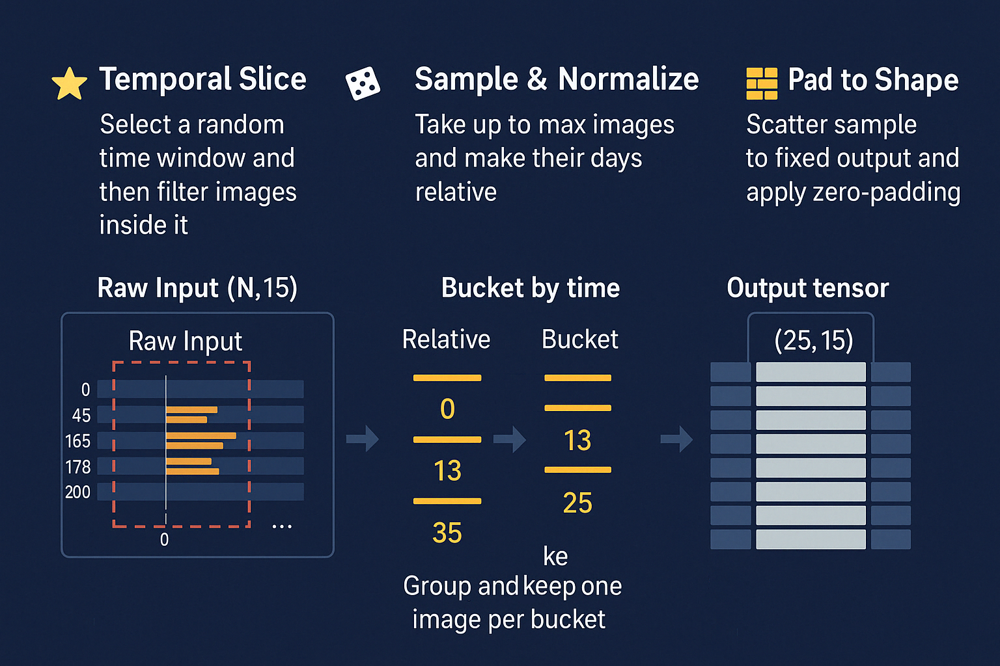
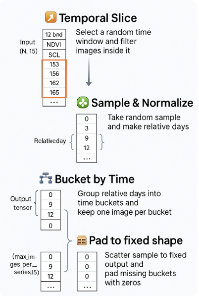

### Overview

---

### Detailed View

---

### Step-by-Step Logic (Example Walkthrough)

┌──────────────────────────────┐  
│  Raw Input (N, 15)           │  
│  ──────────────────────────  │  
│  [12 bands | NDVI | SCL | day]  │  
│  ...                         │  
│  day = [120, 135, 153, 156, 162, 165, 178, 200]  ← absolute days  
└──────────────────────────────┘  
            │  
            ▼  
🪟 1. Temporal Slice (e.g., days_in_series = 30)  
┌──────────────────────────────────────────────────────┐  
│  Random start_day = 150                              │  
│  Keep only days ∈ [150, 180]                         │  
│  → [153, 156, 162, 165, 178]                          │  
└──────────────────────────────────────────────────────┘  
            │  
            ▼  
🎲 2. Sample & Normalize  
┌────────────────────────────────────────────┐  
│  Random sample → keep up to max N (e.g., 5)│  
│  Normalize days:                          │  
│     [153, 156, 162, 165, 178]              │  
│     → [0, 3, 9, 12, 25]                    │  
└────────────────────────────────────────────┘  
            │  
            ▼  
🗂️ 3. Bucket by Time Frame (e.g., days_per_bucket = 10)  
┌────────────────────────────────────────┐  
│  Normalized → bucket_idx               │  
│     [0, 3, 9, 12, 25] → [0, 0, 0, 1, 2] │  
│  Keep first per bucket: idxs = [0, 3, 4]│  
└────────────────────────────────────────┘  
            │  
            ▼  
🧱 4. Pad to Shape (max_images_per_series = 25)  
┌────────────────────────────────────────────────────┐  
│  Output tensor shape = (25, 15)                    │  
│  Fill with:                                        │  
│    bucket 0 → image[0]                             │  
│    bucket 1 → image[3]                             │  
│    bucket 2 → image[4]                             │  
│    all others → [0, 0, ..., 0]                     │  
└────────────────────────────────────────────────────┘  
